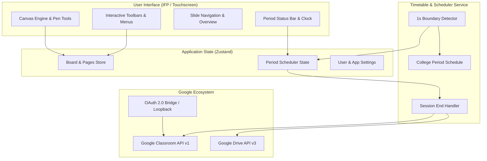

# PaadamVazhi (பாடவழி)

<p align="center">
  
</p>

<h3 align="center">Next-Generation Smart Whiteboard & Automated Classroom Suite for Interactive Flat Panels (IFP)</h3>

<p align="center">
  <strong>PaadamVazhi</strong> (<em>"Path of Lessons"</em>) is a purpose-built, high-performance digital whiteboard and educational automation platform crafted for modern classrooms, touch podiums, and Interactive Flat Panels (IFP).
</p>

<p align="center">
  
  
  
  
  
  
</p>

---

## 📋 Table of Contents

- [Key Features](#-key-features)
  - [🎨 Interactive Flat Panel (IFP) Canvas](#-interactive-flat-panel-ifp-canvas)
  - [⏰ Automated Period & Timetable Scheduler](#-automated-period--timetable-scheduler)
  - [🎓 Seamless Google Classroom Integration](#-seamless-google-classroom-integration)
  - [📑 Slide & Page Management](#-slide--page-management)
  - [💾 Export & Archival Hub](#-export--archival-hub)
- [System Architecture](#-system-architecture)
- [Institutional Timetable Schedule](#-institutional-timetable-schedule)
- [Tech Stack](#-tech-stack)
- [Directory Structure](#-directory-structure)
- [Getting Started](#-getting-started)
  - [Prerequisites](#prerequisites)
  - [Installation](#installation)
  - [Development Server](#development-server)
  - [Linting & Type Checking](#linting--type-checking)
- [Building Android APK](#-building-android-apk)
- [Google Classroom & OAuth Configuration](#-google-classroom--oauth-configuration)
- [License](#-license)

---

## ✨ Key Features

### 🎨 Interactive Flat Panel (IFP) Canvas
- **Multi-Pen Engine**: Choose between **Thin**, **Thick**, **Marker**, **Highlighter**, and **Pencil** pens with configurable stroke width and custom color palettes.
- **Natural Pen Mechanics**: Integrated stroke smoothing, quadratic curve interpolation, and optional pressure sensitivity.
- **Hardware Stylus & Touch Controls**: Toggle between pure stylus mode and multi-touch drawing with palm-rejection accommodations.
- **Dual Eraser System**: Switch between brush-style pixel eraser and rapid object-based stroke removal, plus one-tap canvas clearing.
- **Rich Geometry & Shapes**: Draw perfect rectangles, circles, ellipses, lines, arrows, triangles, diamonds, and stars with customizable borders and fills.
- **Interactive Annotations**: Add draggable Sticky Notes with color coding, formatted rich text blocks, and external image imports.
- **Pan & Zoom Canvas**: Infinite pan navigation with zoom levels from 25% to 400%, fit-to-screen, and quick-reset hotkeys.
- **Full History**: Deep Undo/Redo state stack across all slide modifications.

---

### ⏰ Automated Period & Timetable Scheduler
- **Real-Time Schedule Detection**: Runs a precision background clock checking period boundaries against an institutional college timetable.
- **Continuous Multi-Period Support**: Automatically detects when consecutive periods are taught back-to-back (e.g. 2nd & 3rd Period or 6th & 7th Period) and tracks them as a unified lecture session.
- **Smart Classroom Prompting**: At the exact boundary of each period, prompts the educator to select their target Google Classroom.
- **Automated Period Upload**: When a class session ends (entering Morning Break, Lunch, or After School), PaadamVazhi automatically:
  1. Compiles all active whiteboard slides into a single multi-page PDF.
  2. Uploads the document to Google Drive.
  3. Publishes an announcement directly to the enrolled Google Classroom stream.
- **Simulation Time Travel**: Built-in developer/demonstration time-travel slider to simulate and verify timetable transitions at any hour.

---

### 🎓 Seamless Google Classroom Integration
- **Zero-Friction Authentication**:
  - **Android (Native IFP)**: Embedded local loopback receiver (`localhost:8080`) captures Google OAuth tokens securely without requiring teachers to copy-paste verification codes.
  - **Web**: Google Identity Services (GIS) / direct OAuth modal fallback.
- **Live Course Syncing**: Automatically fetches all active courses where the instructor is registered as a teacher.
- **One-Click Notes Sharing**: Share lecture notes immediately with student rosters at the end of each period or on-demand.

---

### 📑 Slide & Page Management
- **Multi-Page Lecturing**: Seamlessly transition across multiple blackboard/whiteboard slides during a single lecture.
- **Visual Page Overview**: Thumbnail grid drawer for rapid navigation, slide reordering, adding new slides, or deleting outdated pages.
- **Adaptive Backgrounds**: Instantly toggle between:
  - ⚪ Pure White Board
  - ⬛ Sleek Dark Mode (`#121316`)
  - 📐 Engineering Grid
  - ▫️ Dot Matrix
  - 🎨 Custom Accent Colors

---

### 💾 Export & Archival Hub
- **Vector PDF Export**: Exports every board slide into a multi-page PDF via `jspdf`.
- **Image Snapshots**: Instant high-resolution PNG image snapshots.
- **Scalable Vector Graphics**: Full SVG canvas export.
- **JSON Project Backups**: Export and import complete board state files for offline archiving or transferring lectures between IFP displays.

---

## 🏛 System Architecture



---

## ⏰ Institutional Timetable Schedule

PaadamVazhi is configured with the following standard academic schedule:

| Slot | Time Window | Type | Description |
| :--- | :--- | :--- | :--- |
| **P1** | 09:20 AM – 10:00 AM | Period | 1st Period |
| **P2** | 10:00 AM – 10:45 AM | Period | 2nd Period |
| **P3** | 10:45 AM – 11:30 AM | Period | 3rd Period |
| ☕ **Break** | 11:30 AM – 11:45 AM | Break | Morning Break *(Triggers Auto-Upload)* |
| **P4** | 11:45 AM – 12:30 PM | Period | 4th Period |
| **P5** | 12:30 PM – 01:15 PM | Period | 5th Period |
| ☕ **Break** | 01:15 PM – 01:20 PM | Break | Short Break |
| 🍱 **Lunch** | 01:20 PM – 02:05 PM | Lunch | Lunch Break *(Triggers Auto-Upload)* |
| **P6** | 02:05 PM – 02:50 PM | Period | 6th Period |
| **P7** | 02:50 PM – 03:35 PM | Period | 7th Period |
| ☕ **Break** | 03:35 PM – 03:50 PM | Break | Afternoon Break *(Triggers Auto-Upload)* |
| **P8** | 03:50 PM – 04:30 PM | Period | 8th Period *(Final Period)* |

---

## 🛠 Tech Stack

- **Core Framework**: [React 19](https://react.dev/) + [TypeScript 6](https://www.typescriptlang.org/)
- **Bundler & Dev Server**: [Vite 8](https://vite.dev/)
- **State Management**: [Zustand 5](https://github.com/pmndrs/zustand)
- **Mobile / IFP Native Runtime**: [Capacitor 8](https://capacitorjs.com/) (Android 14 / API 34)
- **Vector & PDF Generation**: [jsPDF 4](https://github.com/parallax/jsPDF)
- **Iconography**: [Lucide React](https://lucide.dev/)
- **Linter**: [Oxlint](https://oxc.rs/)

---

## 📂 Directory Structure

```plaintext
whiteboard/
├── android/                   # Capacitor Android native project & Gradle build
├── public/                    # Static assets (logos, icons, web manifest)
├── src/
│   ├── assets/                # App artwork and imagery
│   ├── components/            # React UI components
│   │   ├── Canvas.tsx                 # Core HTML5 interactive canvas
│   │   ├── ClassroomSubmitDialog.tsx  # Google Classroom submission modal
│   │   ├── PeriodStatusBar.tsx        # Top status bar displaying active period & clock
│   │   ├── PeriodClassroomModal.tsx   # Period transition selection modal
│   │   ├── PageNavigation.tsx         # Bottom slide switcher & creator
│   │   ├── PageOverview.tsx           # Slide thumbnail visual drawer
│   │   ├── Toolbar.tsx                # Main IFP drawing toolbar
│   │   ├── PenSettingsPopup.tsx       # Pen size, opacity, and color picker
│   │   ├── EraserSettingsPopup.tsx    # Eraser mode selector
│   │   ├── ShapeMenu.tsx              # Shape insertion dropdown
│   │   ├── InsertMenu.tsx             # Text, note, and image insert menu
│   │   ├── ExportDialog.tsx           # Export to PDF/PNG/SVG/JSON dialog
│   │   ├── SettingsDialog.tsx         # Whiteboard preferences and Google account
│   │   └── SplashScreen.tsx           # Smooth application launch screen
│   ├── hooks/
│   │   └── usePeriodScheduler.ts      # Real-time period evaluation hook
│   ├── services/
│   │   ├── googleClassroom.ts         # Google OAuth, Drive, and Classroom APIs
│   │   └── periodUploadService.ts     # Automated PDF export & upload pipeline
│   ├── store/
│   │   └── useStore.ts                # Central Zustand store (canvas, tools, periods)
│   ├── types/
│   │   └── index.ts                   # Core TypeScript interfaces & data models
│   ├── utils/
│   │   ├── pdfExport.ts               # Multi-page PDF renderer
│   │   └── periodSchedule.ts          # Timetable definitions and time calculations
│   ├── App.tsx                # Application shell & deep-link handler
│   └── main.tsx               # React application entry point
├── build-apk.bat              # One-click Windows batch script to compile Android APK
├── build-apk.ps1              # PowerShell automated APK build script
├── open-in-android-studio.bat # Shortcut to open the Android project in Android Studio
├── capacitor.config.ts        # Capacitor cross-platform configuration
├── package.json               # Project dependencies and npm scripts
└── vite.config.ts             # Vite build configuration
```

---

## 🚀 Getting Started

### Prerequisites
- [Node.js](https://nodejs.org/) (v18.0.0 or higher recommended)
- [npm](https://www.npmjs.com/) (v9 or higher)
- *(Optional, for Android APK)* [Android Studio](https://developer.android.com/studio) with Android SDK (API Level 34) and JDK 17+

### Installation
1. Clone the repository:
   ```bash
   git clone https://github.com/yuvnex/PaadamVazhi.git
   cd PaadamVazhi
   ```

2. Install dependencies:
   ```bash
   npm install
   ```

### Development Server
Start the local Vite dev server with hot module replacement:
```bash
npm run dev
```
Open [http://localhost:5173](http://localhost:5173) in your browser.

### Linting & Type Checking
Verify code quality and type safety:
```bash
# Run oxlint for fast static analysis
npm run lint

# Run TypeScript compilation check and production web build
npm run build
```

---

## 📱 Building Android APK

PaadamVazhi is equipped with automated build scripts tailored for Windows environments and Interactive Flat Panel Android deployments.

### Quick Build (Command Line)
Double-click or run:
```bat
build-apk.bat
```
or via PowerShell:
```powershell
.\build-apk.ps1
```

**What the build script does:**
1. Compiles the modern React web bundle (`npm run build`).
2. Synchronizes static web assets into Capacitor (`npx cap sync android`).
3. Runs the Gradle wrapper (`gradlew.bat assembleDebug`) targeting Android 14.
4. Outputs the finished APK to the project root as `PaadamVazhi.apk` (and `app-debug.apk`).

### Building via Android Studio
If you need to configure device drivers or compile release keys:
```bat
open-in-android-studio.bat
```
Inside Android Studio:
1. Allow Gradle to sync.
2. Navigate to **Build** → **Build Bundle(s) / APK(s)** → **Build APK(s)**.

---

## 🔑 Google Classroom & OAuth Configuration

PaadamVazhi includes a built-in OAuth 2.0 Client ID pre-configured for educational environments.

### Required OAuth Scopes
- `https://www.googleapis.com/auth/classroom.courses.readonly`
- `https://www.googleapis.com/auth/classroom.announcements`
- `https://www.googleapis.com/auth/classroom.courseworkmaterials`
- `https://www.googleapis.com/auth/drive.file`
- `https://www.googleapis.com/auth/userinfo.profile`
- `https://www.googleapis.com/auth/userinfo.email`

### Custom Client ID Setup
To use your institution's own Google Cloud Project:
1. Visit the [Google Cloud Console](https://console.cloud.google.com/).
2. Enable the **Google Classroom API** and **Google Drive API**.
3. Create an **OAuth 2.0 Client ID** (Web application).
4. Add the following Authorized Redirect URIs:
   - `http://localhost:8080` (for Android Native Loopback Bridge)
   - `https://localhost` (for Web testing)
   - Your production web URL (if deployed online)
5. In PaadamVazhi, navigate to **Settings** → **Google Classroom** and enter your custom Client ID.

---

## 📄 License

This project is licensed under the [MIT License](LICENSE).
